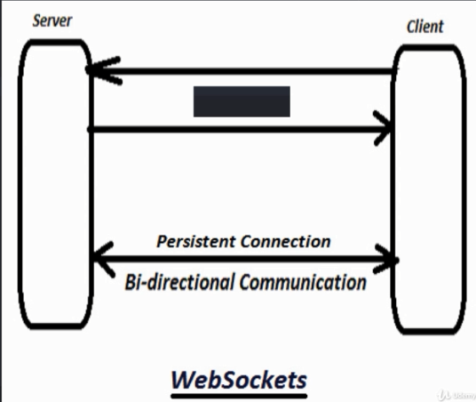

## Simulasyonda Çalıştırma
    Çalıştırmak için yeni bir python environment kurulması gerekir
    
    conda create --name myenviron
    activate myenviron

- Gerekli Yazılımlar
    - [Flask + Socket IO Dökümantasyon](https://flask-socketio.readthedocs.io/en/latest/)
    

### Goal
